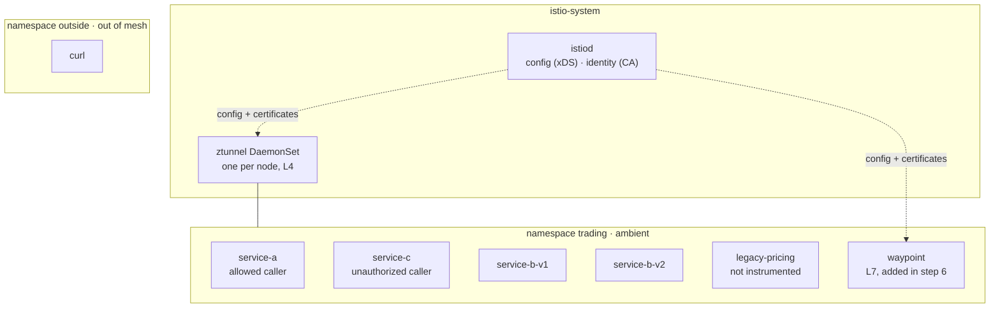
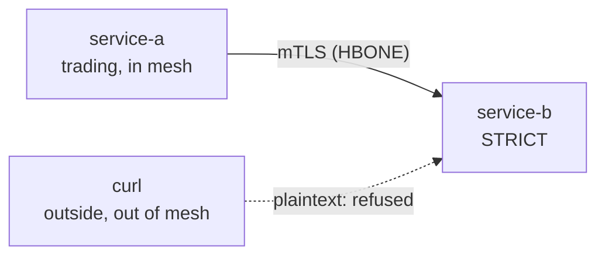
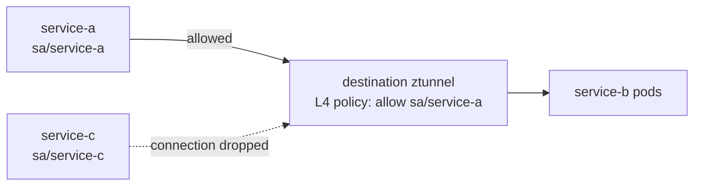
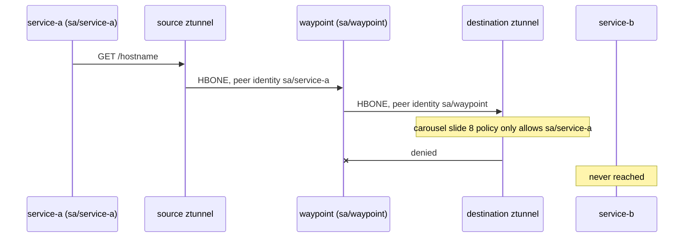
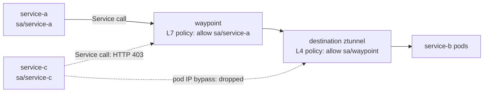
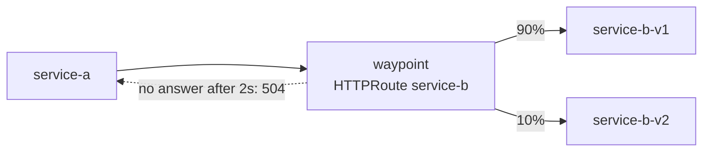
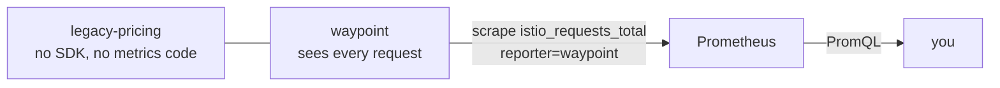

# Lab: Istio Ambient Mode on a Laptop

Companion lab to **CNCF Project Focus · Episode #6 · Istio**.

**Level**: Intermediate · **Duration**: about 45 minutes · **Environment**: Linux or macOS, Docker + kind · **Cost**: free
**Versions**: Istio 1.31.1 · Gateway API v1.6.0 (standard channel) · kind v0.31.0 (node image `kindest/node:v1.35.0`) · go-httpbin v2.15.0
**Verified**: 26 September 2026 · **By**: Christian Dussol

This lab runs the carousel on a local kind cluster, one slide at a time. The names match the carousel (`service-a`, `service-b`, `service-c`, `legacy-pricing`), so **the YAML shown on carousel slides 7, 8 and 9 is applied here as is**, and the PromQL query of carousel slide 10 runs unchanged.

**The lab deliberately contains a failure.** In step 6, adding a waypoint breaks an authorization policy that was correct moments earlier. This is intentional: the failure shows how the enforcement point, and the identity seen by the destination ztunnel, change when L7 processing enters the path.

The lab uses **ambient mode** (carousel slide 11): no sidecars, one ztunnel per node, and a waypoint only where L7 is needed. Carousel slide 6 shows the other data plane mode, sidecars. The security and routing APIs are the same in both modes, but *where* a policy is enforced changes, and step 6 shows why that matters.

## What you'll get

By the end of this lab, your local cluster will show you each of these in action:

- Plaintext from outside the mesh refused, mesh-wide (traffic between mesh workloads is already mTLS in ambient mode)
- An identity-based policy: only `service-a` may call `service-b`
- A waypoint proxy, and what it changes for identity-based policy
- A 90/10 traffic split and a 2s request timeout, declared in one Gateway API `HTTPRoute`
- L7 metrics for a service with no instrumentation, queried in Prometheus

## Lab topology



| Workload | Image | Role |
|---|---|---|
| `service-a` | curl | The allowed caller, identity `sa/service-a` |
| `service-c` | curl | The unauthorized caller, identity `sa/service-c` |
| `service-b-v1`, `service-b-v2` | go-httpbin | The target. `/hostname` returns the pod name, so you can see which version answered. `/delay/{n}` makes the timeout observable |
| `legacy-pricing` | go-httpbin | The code you don't own. `/status/{code}` produces real 5xx errors |
| `curl` in `outside` | curl | A caller outside the mesh |

## Map to the carousel

| Step | Carousel slide | What you prove | Carousel YAML used as is |
|---|---|---|---|
| 2 | 6, 11 | istiod plus one ztunnel per node, no sidecar | |
| 4 | 7 | `PeerAuthentication` STRICT refuses plaintext | `01-peer-authentication.yaml` |
| 5 | 8 | Only `service-a` may call `service-b` | `02-authz-l4.yaml` |
| 6 | 11 | Waypoint for L7, and where identity policy must move | |
| 7 | 9 | 90/10 split and a 2s timeout on `service-b` | `05-httproute.yaml` |
| 8 | 10 | 5xx on `legacy-pricing`, by caller, with no code change | The PromQL query |

## Prerequisites

You need the following tools installed:

- Docker (or another container runtime supported by kind), with at least 4 CPU and 8 GB of memory available
- [kind](https://kind.sigs.k8s.io/) v0.31.0 or later
- `kubectl`
- `jq` (optional, used to read Prometheus answers)

Clone the repo and work from the lab folder:

```bash
git clone https://github.com/christian-dussol-cloud-native/istio.git && cd istio/istio-ambient-lab
```

Download Istio 1.31.1. The archive contains `istioctl`, the `curl` sample and the Prometheus addon:

```bash
curl -L https://istio.io/downloadIstio | ISTIO_VERSION=1.31.1 sh -
export PATH="$PWD/istio-1.31.1/bin:$PATH"
export ISTIO_DIR="$PWD/istio-1.31.1"
istioctl version --remote=false
```

> Expected: `client version: 1.31.1`.

## Step 1: Create the cluster

```bash
kind create cluster --config manifests/kind-config.yaml
kubectl get nodes
```

> Expected: three nodes in `Ready` state, `istio-lab-control-plane`, `istio-lab-worker` and `istio-lab-worker2`. Two workers are enough to see that ztunnel runs once per node.

## Step 2: Install Gateway API and Istio in ambient mode

Gateway API CRDs are not installed by default on most clusters. Istio needs them for waypoints and `HTTPRoute`:

```bash
kubectl get crd gateways.gateway.networking.k8s.io &> /dev/null || \
  kubectl apply --server-side -f https://github.com/kubernetes-sigs/gateway-api/releases/download/v1.6.0/standard-install.yaml
```

Install Istio with the `ambient` profile:

```bash
istioctl install --set profile=ambient --skip-confirmation
kubectl get pods -n istio-system -o wide
```

> Expected: `istiod` (the control plane), plus one `istio-cni-node` pod and one `ztunnel` pod **per node**. There is no Envoy sidecar anywhere: this is the ambient data plane of carousel slide 11.

## Step 3: Deploy the apps

```bash
kubectl create namespace trading
kubectl label namespace trading istio.io/dataplane-mode=ambient
kubectl apply -n trading -f manifests/apps.yaml

kubectl create namespace outside
kubectl apply -n outside -f "$ISTIO_DIR/samples/curl/curl.yaml"

kubectl wait --for=condition=available deployment --all -n trading --timeout=180s
kubectl wait --for=condition=available deployment --all -n outside --timeout=180s
```

> Note: `apps.yaml` creates a `service-b` Service, plus `service-b-v1` and `service-b-v2`. Gateway API splits traffic across Services, not across the DestinationRule subsets of the Istio API. That is why step 7 needs one Service per version.

Check that everything answers before any policy is applied:

```bash
kubectl exec -n trading deploy/service-a -- curl -s http://service-b:8080/hostname
kubectl exec -n trading deploy/service-c -- curl -s http://service-b:8080/hostname
kubectl exec -n outside deploy/curl -- curl -s http://service-b.trading:8080/hostname
```

> Expected: all three return a JSON body such as `{"hostname":"service-b-v1-..."}` or `service-b-v2-...`. With no policy applied, everything can call everything.

## Step 4: Reject plaintext from outside the mesh (carousel slide 7)

In ambient mode, traffic between mesh workloads is already mTLS: ztunnel carries it over HBONE. What `PeerAuthentication` controls here is the other door. The default mode is `PERMISSIVE`: plaintext from outside the mesh is still accepted. You saw it at the end of step 3 with the `outside` caller. Switch to `STRICT`:

```bash
kubectl apply -f manifests/01-peer-authentication.yaml
```

> This is the carousel slide 7 YAML. It is mesh-wide because `istio-system` is Istio's default root namespace.

Replay both calls:



```bash
kubectl exec -n trading deploy/service-a -- curl -s http://service-b:8080/hostname
kubectl exec -n outside deploy/curl -- curl -sS --max-time 5 http://service-b.trading:8080/hostname; echo "exit code: $?"
```

> Expected: the in-mesh call still works. The out-of-mesh call now fails, with a non-zero exit code, because plaintext is refused.
> The error, as observed on this run:
>
> ```
> curl: (56) Recv failure: Connection reset by peer
> exit code: 56
> ```
>
> Exit code 56 is `CURLE_RECV_ERROR`. The destination ztunnel closes the connection: there is no HTTP layer here to return a status.

## Step 5: Only A may call B (carousel slide 8)

This is the carousel slide 8 policy. It uses only `principals`, so it is an L4 policy, enforced by the **destination ztunnel**:

```bash
kubectl apply -f manifests/02-authz-l4.yaml
```



```bash
kubectl exec -n trading deploy/service-a -- curl -s http://service-b:8080/hostname
kubectl exec -n trading deploy/service-c -- curl -sS --max-time 5 http://service-b:8080/hostname; echo "exit code: $?"
```

> Expected: `service-a` gets its answer. `service-c` fails at the connection level: ztunnel has no HTTP layer, so it cannot return a 403. It drops the connection.
> The error, as observed on this run, identical to step 4:
>
> ```
> curl: (56) Recv failure: Connection reset by peer
> exit code: 56
> ```
>
> Same error for a different reason: in step 4 the connection was refused for lack of mTLS, here it is refused for lack of an authorized identity. At L4, both look the same to the caller.

## Step 6: Add a waypoint (carousel slide 11)

So far, everything ran at L4. HTTP routing and HTTP request timeouts need L7 processing, so deploy a waypoint for the `trading` namespace:

```bash
istioctl waypoint apply -n trading --enroll-namespace --wait
kubectl get gateway -n trading
kubectl get pods -n trading -l gateway.networking.k8s.io/gateway-name=waypoint
```

> `--enroll-namespace` labels `trading` with `istio.io/use-waypoint=waypoint`. From now on, traffic addressed to a Service in `trading` goes through the waypoint.

### 6.1 Something just broke

Replay the allowed call:

```bash
kubectl exec -n trading deploy/service-a -- curl -s -w "\nHTTP %{http_code}\n" --max-time 5 http://service-b:8080/hostname; echo "exit code: $?"
```

> Expected: **it fails**, even though `service-a` is the allowed identity. As observed on this run:
>
> ```
> upstream connect error or disconnect/reset before headers. reset reason: connection termination
> HTTP 503
> exit code: 0
> ```
>
> Note the `curl` exit code: **0**. The connection to the waypoint succeeded, so `curl` is satisfied. The failure is now an HTTP status, because an L7 proxy answers where ztunnel alone only dropped the connection. `service-c` gets exactly the same 503 at this point, which is the clue: the caller identity no longer decides anything.

### 6.2 Why

The traffic path is now **service-a → ztunnel → waypoint → ztunnel → service-b**. The destination ztunnel still enforces the carousel slide 8 policy, but the connection it receives now comes from the **waypoint**, with the waypoint's identity, not from `service-a`.



The destination ztunnel says so in its own log. Find the ztunnel on the node running `service-b`, then read it:

```bash
NODE=$(kubectl get pod -n trading -l app=service-b -o jsonpath='{.items[0].spec.nodeName}')
ZT=$(kubectl get pod -n istio-system -l app=ztunnel --field-selector spec.nodeName=$NODE -o jsonpath='{.items[0].metadata.name}')
kubectl logs -n istio-system $ZT --tail=20 | grep 'policy rejection'
```

> As observed on this run, abridged to the fields that matter:
>
> ```
> error   access  connection complete
>   src.workload="waypoint-7b9b6c5cc6-lhlwp"
>   src.identity="spiffe://cluster.local/ns/trading/sa/waypoint"
>   dst.service="service-b-v1.trading.svc.cluster.local"
>   dst.workload="service-b-v1-54c9fd54c8-lznfz"
>   dst.identity="spiffe://cluster.local/ns/trading/sa/service-b"
>   direction="inbound"
>   error="connection closed due to policy rejection: allow policies exist, but none allowed"
> ```
>
> The source identity ztunnel sees is `sa/waypoint`, not `sa/service-a`. The policy is working exactly as written; what changed is who the caller is, seen from the enforcement point.

Istio's documentation states this directly: once a waypoint is in the path, a policy that depends on the source identity should be attached to the waypoint.

### 6.3 Move identity policy to the waypoint

```bash
kubectl delete -f manifests/02-authz-l4.yaml
kubectl apply -f manifests/03-authz-waypoint.yaml
```

This policy uses `targetRefs` to attach to the waypoint `Gateway`, which sees the real caller:

```bash
kubectl exec -n trading deploy/service-a -- curl -s http://service-b:8080/hostname
kubectl exec -n trading deploy/service-c -- curl -s -w "\nHTTP %{http_code}\n" http://service-b:8080/hostname
```

> Expected: `service-a` works again. `service-c` now gets an **HTTP 403**: the waypoint is an L7 proxy, so it can answer with an HTTP status instead of dropping the connection. As observed on this run, for `service-c`:
>
> ```
> RBAC: access denied
> HTTP 403
> ```

### 6.4 Close the bypass

By default, a waypoint handles traffic addressed to **Services**. A caller that targets a **pod IP** directly skips it:

```bash
B_POD_IP=$(kubectl get pod -n trading -l app=service-b,version=v1 -o jsonpath='{.items[0].status.podIP}')
kubectl exec -n trading deploy/service-c -- curl -s --max-time 5 "http://$B_POD_IP:8080/hostname"; echo "exit code: $?"
```

> Expected: **this works**. `service-c` reaches `service-b` without going through the waypoint policy. As observed on this run, `service-c` got a normal answer: `{"hostname":"service-b-v1-..."}`, exit code 0.

The fix is a second layer, at L4, in ztunnel: `service-b` pods only accept in-mesh traffic from the waypoint. First, confirm the waypoint's ServiceAccount name:

```bash
kubectl get pods -n trading -l gateway.networking.k8s.io/gateway-name=waypoint \
  -o jsonpath='{.items[0].spec.serviceAccountName}{"\n"}'
```

> On this run the output was `waypoint`, which is the principal already written in the manifest. If yours differs, edit `manifests/04-authz-l4-waypoint-only.yaml` before applying it.

```bash
kubectl apply -f manifests/04-authz-l4-waypoint-only.yaml

kubectl exec -n trading deploy/service-c -- curl -s --max-time 5 "http://$B_POD_IP:8080/hostname"; echo "exit code: $?"
kubectl exec -n trading deploy/service-a -- curl -s http://service-b:8080/hostname
```

> Expected: the pod IP bypass now fails, and `service-a` still works through the waypoint. As observed on this run, the bypass attempt returned `curl: (56) Recv failure: Connection reset by peer`, exit code 56, while the call through the Service kept answering normally. This is the carousel's "L4 everywhere, L7 only where needed", as two layers of policy: the waypoint decides who may call, ztunnel decides that nobody skips the waypoint.



## Step 7: Route 10% to v2, with a timeout (carousel slide 9)

Apply the carousel slide 9 `HTTPRoute`. One route carries both the 90/10 split and the 2s timeout:

```bash
kubectl apply -n trading -f manifests/05-httproute.yaml
```



### 7.1 Weighted split

`/hostname` returns the name of the pod that answered:

```bash
kubectl exec -n trading deploy/service-a -- sh -c \
  'for i in $(seq 1 200); do curl -s http://service-b:8080/hostname; echo; done' \
  | grep -o 'service-b-v[12]' | sort | uniq -c
```

> Expected: roughly 90% `service-b-v1` and 10% `service-b-v2`. The weights define a probabilistic distribution, applied per request: 200 requests is a small sample, so expect variation around 180/20, not an exact count. This run returned:
>
> ```
>     183 service-b-v1
>      17 service-b-v2
> ```

### 7.2 Request timeout

`/delay/{n}` answers after `n` seconds:

```bash
kubectl exec -n trading deploy/service-a -- curl -s -o /dev/null -w "%{http_code} in %{time_total}s\n" http://service-b:8080/delay/1
kubectl exec -n trading deploy/service-a -- curl -s -o /dev/null -w "%{http_code} in %{time_total}s\n" http://service-b:8080/delay/5
```

> Expected: `200` in about 1 second, then a `504` after about 2 seconds instead of 5. The waypoint stopped waiting; the app code did not change. As observed on this run, three attempts each:
>
> ```
> 200 in 1.002297s    200 in 1.000595s    200 in 0.999160s
> 504 in 1.998335s    504 in 1.987757s    504 in 1.987890s
> ```
>
> These 504s are the waypoint's, and they are counted as such: step 8 finds them in `istio_requests_total` with `response_flags="UT"`, upstream timeout.

## Step 8: Metrics for code you don't own (carousel slide 10)

`legacy-pricing` contains no OpenTelemetry SDK and no metrics code. Install the Prometheus addon shipped with Istio:



```bash
kubectl apply -f "$ISTIO_DIR/samples/addons/prometheus.yaml"
kubectl rollout status deployment/prometheus -n istio-system --timeout=180s
```

Make `legacy-pricing` fail for real: `/status/503` returns a 503 from the app itself.

```bash
kubectl exec -n trading deploy/service-a -- sh -c \
  'for i in $(seq 1 30); do curl -s -o /dev/null http://legacy-pricing:8080/status/503; curl -s -o /dev/null http://legacy-pricing:8080/status/200; done'
```

Open a port-forward to Prometheus:

```bash
kubectl -n istio-system port-forward svc/prometheus 9090:9090 &
```

The carousel slide 10 query, unchanged: 5xx on `legacy-pricing`, by caller.

```bash
curl -s http://localhost:9090/api/v1/query --data-urlencode \
  'query=sum by (source_workload) (rate(istio_requests_total{destination_workload="legacy-pricing", response_code=~"5.."}[5m]))' \
  | jq '.data.result'
```

> Expected: one series, `source_workload="service-a"`, with a non-zero rate. You now know who is hitting the errors of a service you never instrumented. As observed on this run:
>
> ```json
> [
>   {
>     "metric": { "source_workload": "service-a" },
>     "value": [ 1790425664.448, "0.6253243807951697" ]
>   }
> ]
> ```
>
> **Be patient here, and do not conclude the lab failed.** On this run the query first returned an empty result `[]` for a few minutes: Prometheus had not discovered the waypoint as a scrape target yet. Then it returned the series with a value of `0` for several more traffic loops, because `rate()` needs two samples of the counter inside its window. Keep sending the traffic loop and re-running the query. An empty result means "not scraped yet"; a `0` means "scraped once".

The same traffic, as the waypoint reports it:

```bash
curl -s http://localhost:9090/api/v1/query --data-urlencode \
  'query=sum by (source_workload, destination_workload, response_code) (rate(istio_requests_total{reporter="waypoint", destination_workload_namespace="trading"}[5m]))' \
  | jq '.data.result[] | {src: .metric.source_workload, dst: .metric.destination_workload, code: .metric.response_code, rps: .value[1]}'
```

> Expected: `service-a` calling `service-b-v1`, `service-b-v2` and `legacy-pricing`, with `200` and `503` responses. As observed on this run, for `legacy-pricing`:
>
> ```json
> {"src":"service-a","dst":"legacy-pricing","code":"200","rps":"0.6253957631592645"}
> {"src":"service-a","dst":"legacy-pricing","code":"503","rps":"0.6253957631592645"}
> ```
>
> The same rate on both codes is the 30 `/status/503` and 30 `/status/200` calls of the loop above, in equal numbers.
>
> The `service-b` series answer the question step 7 left open: the waypoint's own 504s are counted. Raw counters for this run, after the whole lab:
>
> ```bash
> curl -s http://localhost:9090/api/v1/query --data-urlencode \
>   'query=sum by (destination_workload, response_code, response_flags) (istio_requests_total{reporter="waypoint", destination_workload=~"service-b.*"})' \
>   | jq -r '.data.result[] | "\(.metric.destination_workload) code=\(.metric.response_code) flags=\(.metric.response_flags) total=\(.value[1])"'
> ```
>
> ```
> service-b-v1  code=200  flags=-   total=187
> service-b-v1  code=503  flags=UC  total=3
> service-b-v1  code=504  flags=UT  total=3
> service-b-v2  code=200  flags=-   total=19
> ```
>
> Three outcomes of this lab, in one table, and these counters are cumulative since the waypoint pod started, so they hold the whole run. `UT` is upstream timeout: exactly the three `/delay/5` calls of step 7.2. `UC` is upstream connection termination: the step 6.1 failures, when the destination ztunnel was still dropping the waypoint's connections. And the `200`s carry the step 7.1 split.
> Note `reporter="waypoint"`: in ambient mode, L7 metrics come from the waypoint, not from a sidecar. Without a waypoint, ztunnel only produces TCP metrics.

### From metrics to SLIs

The golden signals of `legacy-pricing`, with no code change. The share of successful requests (an availability SLI):

```bash
curl -s http://localhost:9090/api/v1/query --data-urlencode \
  'query=sum(rate(istio_requests_total{destination_workload="legacy-pricing", response_code!~"5.."}[5m])) / sum(rate(istio_requests_total{destination_workload="legacy-pricing"}[5m]))' \
  | jq '.data.result'
```

The 99th percentile latency, in milliseconds (a latency SLI):

```bash
curl -s http://localhost:9090/api/v1/query --data-urlencode \
  'query=histogram_quantile(0.99, sum by (le) (rate(istio_request_duration_milliseconds_bucket{destination_workload="legacy-pricing"}[5m])))' \
  | jq '.data.result'
```

> Expected: an availability value below 1, since half of the calls in step 8 returned 503, and a latency value in milliseconds. As observed on this run: availability `0.5`, exactly the half of the loop that asked for a 503, and a p99 of `0.6` ms, since `/status/{code}` answers without doing any work. On a real service these two numbers are the availability and latency SLIs you would put behind an SLO, and no line of `legacy-pricing` was touched to get them.
> Saturation, the fourth golden signal, does not come from the mesh: it needs the CPU, memory and queue metrics of the workload itself.

You can also browse the same data with `istioctl dashboard prometheus`.

## What this lab does not cover

| Topic | Why it's out of scope |
|---|---|
| Distributed traces | The proxy can create spans, but joining them end to end requires the app to forward trace headers (carousel slide 10 caveat). |
| Retries in `HTTPRoute` | Still Experimental in Gateway API (GEP-1731). |
| Sidecar mode | Same APIs, different data plane. Carousel slide 6 shows it. |
| Ingress, egress, multi-cluster | Not needed for the carousel's story. |

## Field notes

- **A waypoint moves the enforcement point.** Step 6.1 is the most instructive failure of the lab. The carousel slide 8 policy is correct in sidecar mode and in ambient mode without a waypoint, but it breaks as soon as a waypoint enters the path, because the destination ztunnel then sees the waypoint's identity.
- **Two layers, two failure modes.** A denial by ztunnel drops the connection; a denial by the waypoint returns an HTTP 403. The error you get tells you which layer refused you.
- **Waypoint metrics use `reporter="waypoint"`.** Queries and dashboards written for sidecars filter on `reporter="source"` or `"destination"` and miss this traffic. At the time of writing, an [open Istio issue](https://github.com/istio/istio/issues/61815) tracks updating the service and workload dashboards for this.

## Cleanup

```bash
kill %1 2>/dev/null   # stop the Prometheus port-forward
kind delete cluster --name istio-lab
```

## References

- [Istio ambient mode, Layer 4 security policy](https://istio.io/latest/docs/ambient/usage/l4-policy/)
- [Istio ambient mode, Layer 7 features](https://istio.io/latest/docs/ambient/usage/l7-features/)
- [Istio PeerAuthentication reference](https://istio.io/latest/docs/reference/config/security/peer_authentication/)
- [Istio request timeouts task (Gateway API tab)](https://istio.io/latest/docs/tasks/traffic-management/request-timeouts/)
- [Gateway API conformance reports, Istio](https://github.com/kubernetes-sigs/gateway-api/tree/main/conformance/reports)
- [GEP-1731: HTTPRoute retries](https://gateway-api.sigs.k8s.io/geps/gep-1731/)
- [go-httpbin](https://github.com/mccutchen/go-httpbin)
